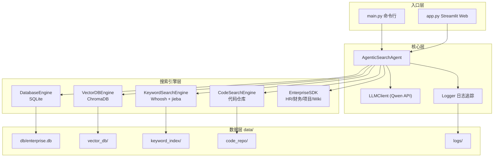

# Agentic Search Qwen — 项目介绍

这是一个**基于 Qwen 大模型的智能企业搜索演示项目**，位于 `llm_case/12-部分场景中可以取代RAG的技术/` 目录下。它展示的是 **Agentic Search（代理式搜索）** 思路：由 LLM 主动推理、选工具、多轮检索，而不是传统 RAG 的「先检索再生成」固定流水线。

---

## 1. 项目定位：与 RAG 的区别

| 维度 | 传统 RAG | 本项目 Agentic Search |
|------|----------|----------------------|
| 检索方式 | 固定向量检索 → 拼上下文 → 生成 | LLM 根据问题**动态选择**数据源和工具 |
| 数据源 | 通常单一文档库 | **6 类异构数据源**（DB、向量、关键词、代码、企业 API、日志） |
| 查询能力 | 语义相似度为主 | 支持 SQL 聚合、精确关键词、API 参数过滤、代码符号搜索 |
| 推理过程 | 黑盒 | 多轮工具调用，可追踪、可可视化 |
| 适用场景 | 文档问答 | 企业综合查询（财务、HR、项目、政策、代码等） |

**核心思想**：把「检索」变成 LLM 可调用的工具集，由模型做意图识别、路由和迭代补充。在结构化查询、跨系统关联等场景下，往往比纯 RAG 更灵活。

---

## 2. 系统架构



---

## 3. 核心工作流程

用户提问后，`AgenticSearchAgent` 进入**最多 20 轮**的 ReAct 式循环（`config.py` 中 `MAX_SEARCH_ROUNDS = 20`）：

1. **构建 System Prompt**：注入当前日期、本周/本月/最近等时间语义，以及意图路由规则。
2. **LLM 推理决策**：调用 Qwen 的 Function Calling，决定调用哪个工具及参数。
3. **执行工具**：在对应引擎中检索，结果以 JSON 字符串返回。
4. **迭代或结束**：信息不足则继续下一轮；足够则直接生成最终答案。
5. **降级兜底**：API 不可用时，走 `_local_search()`，按意图 + jieba 分词做本地多源搜索。

核心循环位于 `core/agent.py` 的 `search()` 方法：

```python
for round_num in range(1, MAX_SEARCH_ROUNDS + 1):
    response = self.llm.chat_with_tools(messages, self.tools)
    if response["tool_calls"]:
        # 执行工具，将结果追加到 messages
        ...
    else:
        # 模型认为信息已足够，返回最终答案
        return final_answer
```

---

## 4. 六大数据源与 13 个工具

Agent 注册了 **13 个 Function Calling 工具**，覆盖企业常见查询类型：

| 工具 | 引擎 | 适用场景 |
|------|------|----------|
| `database_search` / `database_sql` / `database_schema` | SQLite | 员工、部门、项目、合同、产品等结构化数据 |
| `vector_search` / `vector_info` | ChromaDB | 模糊/概念性查询（公司信息、技术文档、会议纪要） |
| `keyword_search` / `keyword_info` | Whoosh + jieba | 精确关键词（政策、技术文章） |
| `code_search` / `code_read` / `code_list` | 本地代码仓库 | 按文件名、内容、符号搜索源码 |
| `enterprise_call` / `enterprise_systems` | 模拟企业 SDK | HR、财务、项目、Wiki 等内部系统 |
| `log_search` | Logger | 历史搜索与决策日志 |

### 意图路由规则（System Prompt 内置）

| 用户意图 | 优先工具 |
|----------|----------|
| 支付/收款/交易/流水/账单 | `enterprise_call(finance, get_payments)` |
| 预算/费用/报销/发票 | `enterprise_call(finance, get_budget/get_invoices/get_expenses)` |
| 员工/人事/组织架构/请假 | `enterprise_call(hr, ...)` 或 `database_search(table=employees)` |
| 项目进度/里程碑 | `enterprise_call(project, ...)` 或 `database_search(table=projects)` |
| 合同/客户 | `database_search(table=contracts)` |
| 产品/价格 | `database_search(table=products)` |
| 公司政策/制度/流程 | `enterprise_call(wiki, search_policies)` 或 `keyword_search` |
| 技术文档/架构/规范 | `enterprise_call(wiki, search_tech_docs)` 或 `keyword_search` / `code_search` |
| 模糊/概念性查询 | `vector_search` |
| 精确筛选/聚合/排序 | `database_sql` |

---

## 5. 目录结构

```
Agentic Search Qwen/
├── main.py              # CLI 入口（初始化数据 + 交互式问答）
├── app.py               # Streamlit Web UI（完整推理过程可视化）
├── config.py            # 路径、API、最大搜索轮次等配置
├── seed_data.py         # 小规模种子数据（含代码仓库模板）
├── seed_data_large.py   # 大规模演示数据生成（100 员工、50 项目等）
├── requirements.txt     # 依赖
├── .env.example         # API Key 配置模板
├── core/
│   ├── agent.py         # 核心 Agent 逻辑（搜索循环、降级、流式追踪）
│   ├── llm.py           # Qwen API 封装（OpenAI 兼容接口）
│   └── logger.py        # 日志与 JSON 追踪
├── engines/
│   ├── database.py      # SQLite 引擎
│   ├── vector_db.py     # ChromaDB 向量检索
│   ├── keyword_search.py# Whoosh 全文检索
│   ├── code_search.py   # 代码仓库搜索
│   └── enterprise_sdk.py# 模拟 HR/财务/项目/Wiki 系统
└── data/                # 运行时数据（自动生成）
    ├── db/              # enterprise.db
    ├── vector_db/       # Chroma 持久化
    ├── keyword_index/   # Whoosh 索引
    ├── code_repo/       # 模拟 CloudEngine 代码库
    └── logs/            # 搜索日志 (.log + .json)
```

---

## 6. 数据初始化

启动时会执行 `seed_all_large()`，生成较完整的演示环境：

| 数据源 | 规模（约） |
|--------|------------|
| SQLite | 100 员工、15 部门、50 项目、40 合同、40 产品 |
| 向量库 | 公司信息 + 技术文档 + 会议纪要 |
| 关键词索引 | 政策文档 + 技术文章 |
| 代码仓库 | 完整 FastAPI 风格项目（`data/code_repo/`） |
| 企业 SDK | 内存 Mock（HR、财务流水、项目、Wiki） |

`data/code_repo/` 是一个独立的 **CloudEngine API** 模拟项目（FastAPI、Docker、测试等），供 `code_search` 检索演示。

---

## 7. 使用方式

### 环境准备

```bash
# 1. 安装依赖
pip install -r requirements.txt

# 2. 配置 API Key
cp .env.example .env
# 编辑 .env，填入 DASHSCOPE_API_KEY
```

环境变量说明：

| 变量 | 说明 | 默认值 |
|------|------|--------|
| `DASHSCOPE_API_KEY` | 阿里云百炼 API Key（必填） | — |
| `DASHSCOPE_BASE_URL` | API 地址 | `https://dashscope.aliyuncs.com/compatible-mode/v1` |
| `DASHSCOPE_MODEL` | 模型名称 | `qwen3.6-plus` |

API Key 获取地址：https://bailian.console.aliyun.com/

### 命令行模式

```bash
python main.py
```

- 自动初始化演示数据
- 交互式输入问题，终端打印每轮工具调用与结果预览
- 输入 `quit` / `exit` / `q` 退出

### Web 界面模式

```bash
streamlit run app.py
```

Streamlit 提供：

- System Prompt 展示
- 每轮 Qwen 推理与工具调用参数
- 工具返回 JSON（财务类会展示收入/支出指标）
- 最终回答生成时的完整 messages 上下文
- 对话历史与侧边栏数据源说明

---

## 8. 技术栈

| 组件 | 技术 |
|------|------|
| LLM | 阿里云百炼 Qwen（OpenAI 兼容 API） |
| 向量库 | ChromaDB 0.4.22 |
| 全文检索 | Whoosh + jieba 中文分词 |
| 结构化数据 | SQLite |
| Web UI | Streamlit |
| API 客户端 | openai SDK |

主要依赖（`requirements.txt`）：

```
chromadb==0.4.22
whoosh>=2.7.4
openai>=1.0.0
jieba>=0.42.1
numpy==1.26.4
posthog<3
streamlit>=1.0.0
```

---

## 9. 特色能力

### 9.1 时间感知

System Prompt 动态注入「今天、本周、本月、最近 7 天」等区间，便于处理「本周支付情况」类问题。

### 9.2 完整追踪

| 方法 | 用途 |
|------|------|
| `search()` | CLI verbose 输出 |
| `search_with_trace()` | 返回完整 trace 字典 |
| `search_stream()` | 流式 yield，供 Streamlit 逐步渲染 |

### 9.3 API 降级

检测连接/鉴权等错误后，自动切换到 `_local_search()`：

- 按 finance / hr / project 意图优先查企业 SDK
- 再扫描 DB、向量库、关键词索引
- 使用 jieba 分词提取关键词，过滤停用词

### 9.4 日志审计

`Logger` 单例写入：

- `data/logs/agentic_search_YYYYMMDD.log` — 文本日志
- `data/logs/agentic_search_YYYYMMDD.json` — JSON 结构化日志

Agent 还可通过 `log_search` 工具查询历史决策。

---

## 10. 典型问题示例

| 问题类型 | 预期工具链 |
|----------|------------|
| 「本周的支付数据情况如何？」 | `enterprise_call(finance, get_payments)` + 日期参数 |
| 「技术部有哪些高级工程师？」 | `database_search` 或 `enterprise_call(hr, search_employees)` |
| 「智能客服项目进度怎么样？」 | `enterprise_call(project, ...)` 或 `database_search(table=projects)` |
| 「远程办公政策是什么？」 | `enterprise_call(wiki, search_policies)` 或 `keyword_search` |
| 「UserService 里怎么实现登录？」 | `code_search` → `code_read` |
| 「公司微服务架构怎么设计的？」 | `vector_search` 或 Wiki 技术文档 |

---

## 11. 企业 SDK 模拟系统

`engines/enterprise_sdk.py` 提供四类内存 Mock 系统：

### HR 系统 (`hr`)

| Action | 说明 |
|--------|------|
| `get_employee` | 按员工 ID 查询 |
| `search_employees` | 关键词搜索员工 |
| `get_leave_records` | 请假记录 |
| `get_org_chart` | 组织架构 |

### 财务系统 (`finance`)

| Action | 说明 |
|--------|------|
| `get_payments` | 支付流水（支持 type/日期过滤） |
| `get_transactions` | 交易流水 |
| `get_budget` | 部门预算 |
| `get_invoices` | 发票 |
| `get_expenses` | 费用报销 |

### 项目系统 (`project`)

| Action | 说明 |
|--------|------|
| `search_projects` | 搜索项目 |
| `get_project` | 项目详情 |
| `get_milestones` | 里程碑 |

### Wiki 系统 (`wiki`)

| Action | 说明 |
|--------|------|
| `search_policies` | 公司政策 |
| `search_tech_docs` | 技术文档 |

---

## 12. 总结

本项目是一个**教学/演示型 Agentic Search 系统**，用 Qwen 的 Function Calling 把多种企业数据源统一成「可推理、可组合、可追踪」的搜索能力。

适合用来理解：

- 何时用 Agentic Search 替代或补充 RAG
- 多源异构数据下的工具路由与多轮检索
- LLM + Tool Use 在企业问答中的工程化落地（日志、降级、可视化）
