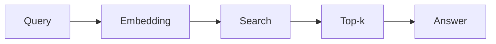
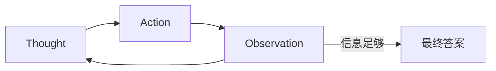
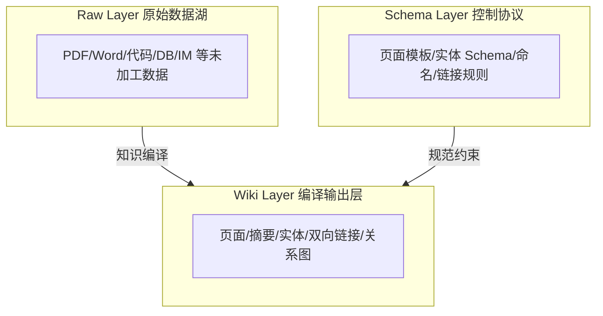
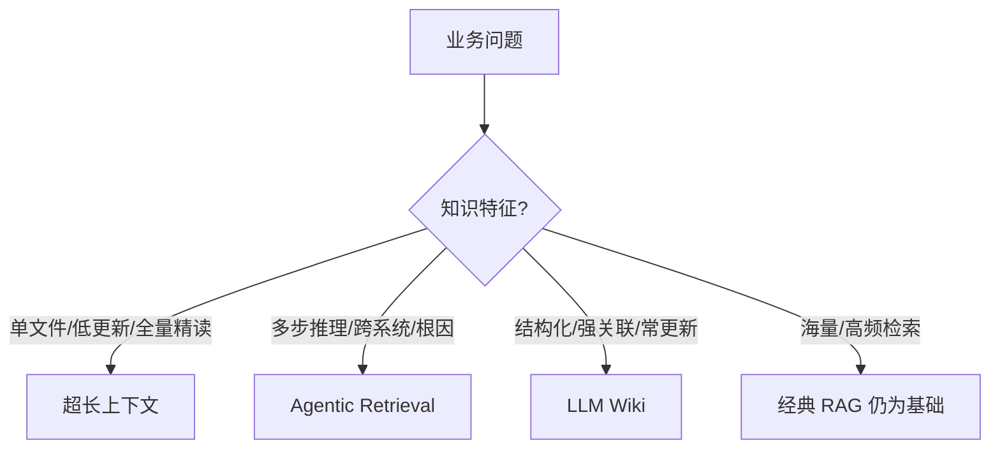

# 可能替代 RAG 的技术

## 摘要

媒体常将「超长上下文」「Agentic Retrieval」「LLM Wiki」宣传为 RAG 的替代者；三者实则与 RAG 多为互补而非完全对立。超长上下文适合小体量、单文档的全局理解；Agentic Retrieval 将检索升级为由 LLM 主导的推理循环；LLM Wiki 则在摄入阶段把知识编译为可导航的结构化体系。选型取决于知识规模、更新频率、关联复杂度与是否需跨系统推理。

## 核心知识点关键词

- **超长上下文**：全量投喂、注意力衰减、YaRN、中间遗忘、Token 成本
- **Agentic Retrieval**：Reason-Retrieve Loop、ReAct、Thought-Action-Observation、五层架构
- **LLM Wiki**：页面化、双向链接、层级目录、实体关系、Ingest-time Intelligence
- **选型**：读一遍单文件 → Long Context；查多步跨系统 → Agentic；要沉淀强关联常更新 → LLM Wiki

## 要点速览与十章索引

下列条目合并「导图」与章节目录，每条 = 章名 + 一句抓手。

1. **传统 RAG 的本质** — 固定流水线：Query → Embedding → Search → Top-k → Answer，LLM 被动总结。
2. **超长上下文原理** — 整库直喂模型，从片段理解跃迁为全局推理。
3. **长窗口的训练与现实** — 宣传窗口多为理论值，有效利用率约 25%；预训练窗口策略决定长文本能力。
4. **超长上下文与 RAG 的边界** — 小库/单文档可替代；海量库、成本、注意力衰减下仍依赖 RAG。
5. **Agentic Retrieval 范式** — LLM 主导「搜什么、何时搜、下一步搜什么、何时停」。
6. **ReAct 与推理检索循环** — Reason → Retrieve → Observe → Repeat，从一次性到持续性。
7. **Agentic 五层架构** — Tool / Planner / Memory / Reasoning Loop / Execution Runtime。
8. **LLM Wiki 核心构件** — 页面化、双向链接、层级目录，告别 Chunk 碎片化。
9. **LLM Wiki 进阶与三层架构** — 实体关系、自动摘要/索引、语义导航；Raw / Wiki / Schema 编译体系。
10. **选型指南与挑战** — 三大技术口诀对照；工程成本、更新难度与超实时数据局限。

## 1. 传统 RAG 的本质

### 固定的流水线

#### 核心概念

- 标准流程：**Query → Embedding → Search（向量库/余弦相似度）→ Top-k → Answer**。
- 检索策略、召回数量等在运行前写死；LLM 只读取 Top-k 片段并生成答案，**不参与检索决策**。
- 线性流程下，大模型角色接近「文本总结者」，而非检索规划者。

#### 图示要点



#### 最低限度回忆（不超过3条）

- RAG 默认单次、固定策略检索。
- LLM 在经典 RAG 中不决定「搜什么、搜几次」。
- 片段拼接易割裂跨段逻辑与全局语境。

## 2. 超长上下文原理

### 直接「喂」整个文档库

#### 核心概念

- **超长上下文**：利用模型扩展的上下文容量，将完整文档库直接作为输入，**绕过检索与拼接**。
- 传统模式：检索 + 拼接，易丢失全局信息。
- 超长模式：完整文档库 → 直接输入 → 模型，实现从「片段理解」到「全局推理」。

#### 示例与直观理解

- 适用知识类型：产品说明书、法律合同、财务年报；完整代码仓库；数小时会议记录。
- 工作流对比：
  - 传统：知识库 → 检索 → 拼接 → 模型
  - 超长：完整文档库 → 直接输入 → 模型

#### 最低限度回忆（不超过3条）

- 核心逻辑是「不检索、全量读」。
- 价值在于保持文档内逻辑连贯。
- 与 RAG 是互补关系，非简单替代。

## 3. 长窗口的训练与现实

### 理论窗口 vs 有效利用

#### 核心概念

- 宣传的上下文长度多为**理论最大值**；受注意力衰减等影响，**实际有效利用率约 25%**。
- 预训练与扩展阶段的训练策略、数据投入，是决定长文本能力的核心变量。

#### 主流模型扩展路径（材料对比）

| 模型 | 预训练基础 | 扩展路径 |
|------|------------|----------|
| DeepSeek v3 | 超 95% 训练（14.8T tokens）在 4K 完成 | YaRN 两阶段快速扩展，每阶段约 1000 步微调：4K → 32K → 128K |
| GLM 5.1 | 超 95% 数据在 4K 预训练 | 预训练中期设「长窗口适配」：4K → 32K(1T) → 128K(500B) → 200K(50B) |
| Kimi K2.6 | 主力训练（>90%）在 4K，少量 8K | 后期专门适配；YaRN + MLA 双重优化 |

#### 预训练窗口策略差异

| 模型 | 策略特点 |
|------|----------|
| GLM 5.1 / Kimi K2.6 | 典型传统：绝大部分小窗口（4K/8K）预训练，依赖后期长窗口适配 |
| DeepSeek v4 Flash | 小窗口仅占约 3.125%；**96.875% 数据在 64K/1M 完成** |
| DeepSeek v4 Pro | 小窗口推测 <6%；延续原生超长窗口路线 |

> **结论**：主流模型多以 4K 完成绝大多数预训练，通过 YaRN 等技术扩展；**在预训练阶段「喂饱」长上下文**，而非仅微调适配，正成为拉开长文本能力的关键路径。

#### 常见错误与注意点

- 勿将标称窗口长度等同于可用上下文。
- 「中间遗忘」：模型难以均匀利用超长文本全部位置的信息。

#### 最低限度回忆（不超过3条）

- 有效利用率远低于标称窗口。
- YaRN 等用于窗口扩展。
- DeepSeek v4 系列代表「原生超长窗口预训练」新标杆。

## 4. 超长上下文与 RAG 的边界

### 何时能替代、何时不能

#### 核心概念

超长上下文与 RAG **互补**：小体量、单文档场景下语境更连贯；海量知识场景下 RAG 仍是企业级基石。

#### 适合替代的场景

- **小型知识库**：几十至几百万 Token（企业制度、说明书等），可直接喂给模型。
- **单文档强相关**：合同分析、财报研读，需完整语境避免割裂。
- **高精度理解**：避免 Chunk 切碎与 Embedding 失真；更适合表格、跨页引用、代码逻辑。

#### 无法替代的局限

- **规模**：百万级文档、10TB 级知识无法一次性塞进窗口。
- **成本**：Token 消耗随上下文长度大幅增加，规模化难承受。
- **注意力衰减**：「中间遗忘」，无法稳定利用超长文本全部信息。

#### 与前后章节的联系

- 选型口诀（见第 10 章）：「读一遍、单文件、不改了」→ Long Context。

#### 最低限度回忆（不超过3条）

- 小库 + 单文档 + 低更新 → 倾向超长上下文。
- 海量库 + 高成本敏感 → 仍用 RAG。
- 二者互补，非零和对立。

## 5. Agentic Retrieval 范式

### 从被动检索到主动推理

#### 核心概念

- 在 Agentic Retrieval 中，**LLM 成为流程主导者**，自主驱动检索。
- 核心转变：**Retrieval becomes Reasoning**（检索即推理）。

#### LLM 自主决策的四类问题

| 决策维度 | 含义 |
|----------|------|
| 搜什么 (What) | 将模糊问题转化为精准搜索指令 |
| 何时搜 (When) | 判断是否已有足够背景知识 |
| 下一步搜什么 (Next) | 根据信息缺口动态规划路径 |
| 停止或迭代 (Termination) | 评估证据是否充分、是否存在矛盾 |

#### 架构对比

| 范式 | 流程 | 特征 |
|------|------|------|
| 传统 RAG | Query → Retrieve → Generate | 「输入即检索，检索即回答」 |
| Agentic | Reason → Retrieve → Observe → Repeat | 从「一次性」到「持续性」 |

#### 最低限度回忆（不超过3条）

- LLM 参与检索规划，而非只读 Top-k。
- 适合复杂、多步、需动态调整的问题。
- 与 ReAct 等 Agent 范式同源。

## 6. ReAct 与推理检索循环

### ReAct Pattern

#### 核心概念

- ReAct：通过交替 **Reason（推理）** 与 **Act（行动）** 逐步拆解复杂问题。
- 三步闭环：**Thought → Action → Observation**，重复直至信息足够。

| 步骤 | 作用 |
|------|------|
| Thought | 基于历史与任务，推理下一步操作 |
| Action | 调用工具（搜索、DB、代码运行等） |
| Observation | 理解行动结果，作为下一轮输入 |

#### 示例与代码

**企业案例：追踪退款率升高原因**

1. **Thought**：假设与支付接口失败、APP 新版本、客服策略有关。
2. **Action**：`{"tool": "search_logs", "query": "退款失败 最近7天"}`
3. **Observation**：支付宝接口调用失败率异常上升。
4. **Thought**：需排查支付系统近期更新。
5. **Action**：`{"tool": "search_release_notes", "query": "支付系统 最近更新"}`
6. **结论**：锁定系统更新导致的支付接口异常。

#### 推导与步骤



#### 最低限度回忆（不超过3条）

- ReAct = Thought + Action + Observation 循环。
- Observation 驱动下一轮 Thought。
- 典型用于根因分析、多假设验证。

## 7. Agentic 五层架构

### 技术实现：五层架构

#### 核心概念

| 层级 | 角色 |
|------|------|
| **01 Tool Layer** | 向量检索、关键词搜索、DB 查询、知识图谱、API；连接外部知识 |
| **02 Planner** | 「大脑」：拆解任务，决定下一步调用哪个工具；初级用 Prompt，进阶用独立规划模型 |
| **03 Memory** | 已搜查询、已访问页面、已知事实、假设；类比侦探调查笔记 |
| **04 Reasoning Loop** | `while not solved: Think → Act → Observe`；含最大步数、置信度阈值、自我反思 |
| **05 Execution Runtime** | 长生命周期工作流的调度、状态、并发、错误处理 |

#### 执行运行时框架

- **LangGraph**：有状态、可循环的 Agent 图工作流。
- **AutoGen**：多智能体对话协作。
- **CrewAI**：角色扮演与任务协作。
- **OpenAI Agents SDK**：安全执行 + 工具调用 + 多角色协作。

#### 常见错误与注意点

- 无步数上限易导致无限循环。
- Agent 是长生命周期工作流，需 Runtime 而非单次函数调用。

#### 最低限度回忆（不超过3条）

- 五层：Tool / Planner / Memory / Loop / Runtime。
- 企业级 Loop 需步数限制与置信度阈值。
- LangGraph、AutoGen 等承载有状态 Agent。

## 8. LLM Wiki 核心构件

### 从「切碎知识」到「保留结构」

#### 核心概念

- 传统 RAG 痛点：强制碎片化 → 上下文断裂、逻辑丢失。
- LLM Wiki：**保留原始结构**，为 LLM 构建可阅读、可导航的知识空间。
- 定位：为大模型重构的企业级知识体系（类似面向机器的 Confluence / Wikipedia）。
- 核心价值：**Structured Knowledge > Fragments**。

#### 工作模式对比

| 模式 | 流程 | 特征 |
|------|------|------|
| 传统 RAG | Query → Embedding → Top-k Chunk → Answer | 检索即终点，线性匹配 |
| LLM Wiki | Query → 定位入口页 → Agent 逐步导航 → 扩展关联页 → Answer | 模拟浏览维基，构建知识图景 |

### 一：页面化 (Page-based Knowledge)

#### 核心概念

- **问题**：固定 Chunk 丢失页面身份、主题边界；同一主题被切成 Chunk_182 + Chunk_183，LLM 无法识别归属。
- **流程**：文档解析（标题/段落/表格）→ 结构识别（Markdown 层级、父子树）→ 生成 Page Object（`page_id` / `title` / `content` / `summary`）。

### 二：双向链接 (Bi-directional Links)

#### 核心概念

- 打破孤岛，支持多跳扩展；突破 Top-k 仅返回「直接匹配」的局限。
- 示例关联链：退款规则 ↔ 财务审批 ↔ 发票制度 ↔ 税务政策。
- 实现步骤：NER 识别实体 → 生成 `[[实体]]` 链接 → 维护反向索引。
- 技术选型：简单版用向量相似度；进阶版用知识图谱 (KG)。

```json
{"API Key": ["OpenAI API文档", "系统权限管理规范", "API鉴权机制说明"]}
```

### 三：层级目录 (Hierarchy Tree)

#### 核心概念

- 引导 LLM 先定位大类再聚焦细节，模拟查阅书籍。
- 实现：解析 Markdown 标题层级建 AST；或对无结构文本用 LLM 输出 JSON 层级。
- 存储示例：`{ "node_id": "1001", "parent_id": "1000", "children": [...] }`；支持树遍历、层级检索、章节扩展。

#### 最低限度回忆（不超过3条）

- 页面 > Chunk：保留主题边界与语义完整。
- 双向链接支持多跳推理与关联扩展。
- 层级目录提升「先大类后细节」的检索效率。

## 9. LLM Wiki 进阶与三层架构

### 四：实体关系 (Entity Relationship)

#### 核心概念

- 从非结构化文本抽取 **实体 + 关系**，构建可计算骨架。
- 示例：「张三负责 Apollo 项目。Apollo 项目服务于腾讯。」→ `(张三, 负责, Apollo)`、`(Apollo, 客户, 腾讯)`。
- 实现：LLM 端到端 Prompt 抽取（主流）；传统 NLP（NER、依存句法）在极致效率场景仍有应用。
- 存储：图数据库（如 Neo4j）→ 知识图谱。

### 五：自动摘要 (Auto Summary)

| 层级 | 作用 |
|------|------|
| Chunk Summary | 最小语义单元提炼 |
| Page Summary | 聚合 Chunk 为页面级摘要 |
| Section Summary | 文档/章节宏观摘要 |

- **Query-aware Summary**：按用户问题动态提取，接近 Agentic Retrieval；示例字段：`{page, summary_short, key_points}`。

### 六：自动索引 (Auto Indexing)

- 本质：为知识建立多种访问入口，打破单向量检索局限。
- **混合搜索**：BM25（关键词）+ Vector（语义）+ Graph（关联）。
- 索引类型：Vector、BM25、Entity、Graph、Hierarchy、Temporal、Permission。
- 技术栈：Elasticsearch/OpenSearch、Weaviate/Milvus、Vespa。

### 七：Semantic Navigation（语义导航）

#### 核心概念

- 从「召回」到「导航」：LLM 自主决定下一步探索位置。
- 示例路径（退款失败为何增多）：退款规则 → 支付系统 → 版本更新 → Bug 报告 → 客服工单。
- 流程：`reason → retrieve → read → decide next retrieve`。
- 架构：ReAct、Tree Search（BFS/MCTS on KG）。
- **本质区别**：传统 RAG 中检索是系统行为；语义导航中检索是**模型自主行为**。

### Karpathy 三层架构



| 层级 | 职责 |
|------|------|
| **Raw Layer** | 事实来源；混乱不可控，保留原始事实供回溯 |
| **Wiki Layer** | AI「编译」后的结构化知识；知识编译器输出 |
| **Schema Layer** | 页面模板、实体 Schema、命名与链接规则；保证长期可维护 |

> **核心转变**：从 **Query-time Intelligence**（查询时理解）转向 **Ingest-time Intelligence**（摄入时编译）——将企业知识库升级为「AI 时代的知识编译系统」。

### 知识持续演化

| 模式 | 更新方式 | 本质 |
|------|----------|------|
| 传统 RAG (Append-only) | 新文档 → 切分 → 向量化 → 入库 | 仅新增素材，不更新摘要/实体/关系 |
| LLM Wiki (Recompilation) | 新知识 → 解析 → 重构 → 全局更新 | 类似增量编译，实体/关系/摘要连锁变化 |

**企业级更新流水线（9 步）**：变更检测 → 文档解析 → 实体抽取 → 关联分析 → 页面更新 → 摘要重建 → 图谱更新 → 索引刷新 → 一致性检查。

**触发机制**：

- **主动（外部事件）**：原始数据变更、Schema 规则迭代触发重编译、外部源同步。
- **被动（内部逻辑）**：实体属性变更的连锁重构、业务流程产出物自动纳入。

#### 现实挑战

- 级联更新成本高；LLM 生成时间不一致；实体多命名漂移；自动链接过量；摘要级联失效。
- 构建成本高（解析、拆分、实体、链接、图谱）；知识更新难（关系依赖导致维护成本高）；**不适合超实时数据**（股票、IoT 流、实时日志 → 时序库/实时查询更优）。

#### 最低限度回忆（不超过3条）

- Ingest-time 编译 > Query-time 临时理解。
- 更新是「重编译」而非简单 append。
- 超实时场景不宜用 LLM Wiki。

## 10. 选型指南与未来展望

### 超长上下文选型

| 维度 | 说明 |
|------|------|
| 适用特征 | 一次性处理、单文档为主、低更新频率；追求读全量原文 |
| 典型场景 | 法律/合同/审计审阅；代码/PR 完整 Review；静态长文档问答（说明书、白皮书） |
| 优势 | 架构极简、无 Chunk 丢失、开发与运维复杂度低 |
| 不适用 | 高频更新实时库、海量非结构化检索、极低延迟交互 |
| **金句** | 「读一遍、单文件、不改了」→ Long Context |

### Agentic Retrieval 选型

| 维度 | 说明 |
|------|------|
| 核心思想 | 多步推理、跨数据源关联、强逻辑链 |
| **口诀** | **查多步 · 跨系统 · 找根因** → Agentic Retrieval |
| 典型场景 | 复杂故障根因分析；跨 CRM/合同/财务的复杂咨询；客服非标准疑难 |

### LLM Wiki 选型

| 维度 | 说明 |
|------|------|
| 核心逻辑 | 结构化、强关联、持续迭代、长期维护 |
| **口诀** | **要沉淀、强关联、常更新** → LLM Wiki |
| 典型场景 | 技术资产（代码/API/变更史）；产品项目体系（PRD/交付手册/会议纪要）；制度规范（报销/入职/合规，条款间强关联） |

### 三大技术对照



| 技术 | 一句话定位 |
|------|------------|
| 超长上下文 | 用窗口换检索，适合「读一遍」 |
| Agentic Retrieval | 用推理换固定检索，适合「查清楚」 |
| LLM Wiki | 用编译换碎片化，适合「养知识」 |
| 经典 RAG | 海量知识检索的规模化基石 |

#### 与前后章节的联系

- 媒体「替代 RAG」叙事需降维：三者多场景为 **RAG 的增强或分工**，而非全盘替换。

#### 最低限度回忆（不超过3条）

- 三条选型口诀覆盖多数场景。
- LLM Wiki 目标是「可进化的知识操作系统」。
- 企业知识应从「死数据」走向「活系统」。

## 术语与符号

| 术语/符号 | 定义 | 备注 |
|-----------|------|------|
| RAG | Retrieval-Augmented Generation，检索增强生成 | 经典流水线检索 + 生成 |
| Long Context | 超长上下文 | 全量文档直喂 LLM |
| Agentic Retrieval | 由 Agent/LLM 主导的多步检索推理 | Retrieval becomes Reasoning |
| ReAct | Reason + Act 交替的 Agent 范式 | Thought-Action-Observation |
| LLM Wiki | 面向 LLM 的结构化企业知识体系 | 页面化 + 链接 + 层级 |
| YaRN | 上下文窗口扩展技术 | DeepSeek、Kimi 等采用 |
| MLA | Multi-head Latent Attention | Kimi K2.6 长窗口优化 |
| BM25 | 经典关键词检索算法 | 常与向量检索混合 |
| Ingest-time Intelligence | 摄入阶段编译知识 | 相对 Query-time |
| KG | Knowledge Graph，知识图谱 | Neo4j 等存储 |

## 图示与案例索引

| 文中标签 | 一行含义 |
|----------|-----------|
| 传统 RAG 流水线 | Query → Embedding → Search → Top-k → Answer |
| Reason-Retrieve Loop | Reason → Retrieve → Observe → Repeat |
| ReAct 退款率案例 | 日志失败率 → 版本记录 → 定位支付接口更新 |
| LLM Wiki 导航 | 入口页 → 链接跳转 → 扩展关联 → 综合作答 |
| 三层架构 | Raw 原始湖 → Wiki 编译层 ← Schema 规则层 |
| 更新流水线 9 步 | 检测到一致性检查的全链路重编译 |

## 关键摘录（精简）

> 在这个线性流程中，检索逻辑是写死且固定的……强大的大语言模型在此过程中仅仅充当了「文本总结者」的角色，完全被动地读取结果，不参与任何检索决策。

> 核心转变：Retrieval becomes Reasoning

> Structured Knowledge > Fragments — 让 LLM 在完整的知识图谱中进行推理。

> 核心转变：从 Query-time Intelligence（查询时理解）转向 Ingest-time Intelligence（摄入时编译）。

> 传统 RAG 视知识为「被动存储」；LLM Wiki 视知识为「持续演化的动态系统」，旨在构建「可进化的知识操作系统」。

## 复习要点

1. 经典 RAG 是固定单次检索；LLM 不规划搜索路径。
2. 超长上下文有效利用率约 25%，适合小库/单文档/低更新，不适合海量库与高 Token 成本场景。
3. Agentic Retrieval = LLM 决定搜什么、何时搜、下一步与终止；底层常实现为 ReAct 循环。
4. Agentic 五层：Tool、Planner、Memory、Reasoning Loop、Runtime（LangGraph 等）。
5. LLM Wiki 用页面、双向链接、层级、实体关系替代盲目 Chunk；摄入时编译（Raw/Wiki/Schema）。
6. 选型口诀：读一遍单文件 → Long Context；查多步跨系统 → Agentic；要沉淀强关联常更新 → LLM Wiki。
7. LLM Wiki 挑战：构建与级联更新成本高，不适合超实时流数据；RAG append-only 无法维护关系与摘要一致性。
